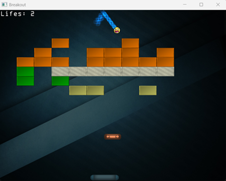

# Breakout:

## Introduction:
This is a Breakout game, which Joey de Vries implemented and its tutorial is [here](https://learnopengl.com/In-Practice/2D-Game/Breakout).  
Its [license](https://learnopengl.com/code_viewer_gh.php?code=src/7.in_practice/3.2d_game/0.full_source/progress/2.program.cpp).  
But I recreated it with my own Engine.  

## License:
Breakout © 2025 by Zsolt Sziráczki is licensed under [CC BY 4.0](https://creativecommons.org/licenses/by/4.0/).  

## Control
- Start: Press Enter
- Close Window: Press Esc or use your mouse.
- Select Map: Press W and S
- Player control: Press A and D
- Shooting the ball: Press Space

## Assets:
The assets files came from learnopengl tutorial.

## Properties:
- Configuration Type:  
  - Application (.exe)
- C/C++ => Additional Include Directories:  
  - ..\Learning2DEngine  
  - $(SolutionDir)Plugins\Engine\include
- Post-Build Event:  
	When you build the game, the assets folder will be copied into output directory.  
    Note: if some files exist, they will be overwritten.

### Source code: [here](../Breakout)