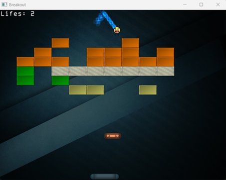

# Breakout:

## Introduction:
This is a Breakout game, which Joey de Vries implemented and its tutorial is [here](https://learnopengl.com/In-Practice/2D-Game/Breakout).  
Its [license](https://learnopengl.com/code_viewer_gh.php?code=src/7.in_practice/3.2d_game/0.full_source/progress/2.program.cpp).  
But I recreated it with my own Engine.  

## License:
Breakout © 2025 by Zsolt Sziráczki is licensed under [CC BY 4.0](https://creativecommons.org/licenses/by/4.0/).  
_Note: In the past, it was under the CC BY-NC 4.0, but it has changed from v1.7.0._

For sounds, there is the irrKlang, which I use it with
its non pro license, which is [here](https://www.ambiera.com/irrklang/license.html).  
_Note: It is removeable from the code, if the USE_IRRKLANG_SOUND_ENGINE macro define as 0 and not 1._  
_But the irrKlang references have to be removed manually from the VC++ Directories, Linker and Post-Build Event._

## Control
- Start: Press Enter
- Close Window: Press Esc or use your mouse.
- Select Map: Press W and S
- Player control: Press A and D
- Shooting the ball: Press Space

## Assets:
The assets files came from learnopengl tutorial.

## Properties:
- Configuration Type:  
  - Application (.exe)
- VC++ Directories => Library Directories:  
  - $(SolutionDir)Plugins\Game\lib\irrKlang
- C/C++ => General => Additional Include Directories:  
  - ..\Learning2DEngine  
  - $(SolutionDir)Plugins\Engine\include  
  - $(SolutionDir)Plugins\Game\include
- Linker => Input => Additional Dependencies:  
  - irrKlang.lib
- Post-Build Event:  
  When you build the game, the assets folder will be copied into output directory.
  Plus the irrKlang DLL files are also copied into output directory from Plugin folder for the sounds.  
  Note: if some files exist, they will be overwritten.

### Source code: [here](../Breakout)