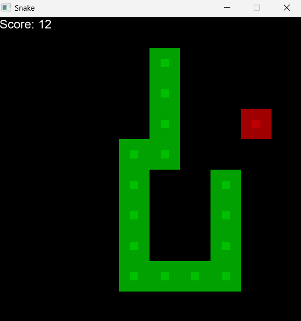

# Snake

## Introduction:
It is just a simple snake game, where the edge of the screen also kill your snake.

## License:
Snake © 2025 by Zsolt Sziráczki is licensed under [CC BY 4.0](https://creativecommons.org/licenses/by/4.0/).  
_Note: In the past, it was under the CC BY-NC 4.0, but it has changed from v1.7.0._

## Control
- Start: Press Enter
- Close Window: Press Esc or use your mouse.
- Character control: WASD or Arrows

## Assets:
- arial.ttf: It came from the Windows. You can also find it in your Windows OS.
- Unit.png: it is a simple image, which I created with Paint.

## Properties:
- Configuration Type:  
  - Application (.exe)
- C/C++ => Additional Include Directories:  
  - ..\Learning2DEngine  
  - $(SolutionDir)Plugins\Engine\include
- Post-Build Event:  
	When you build the game, the assets folder will be copied into output directory.  
    Note: if some files exist, they will be overwritten.

### Source code: [here](../Snake)