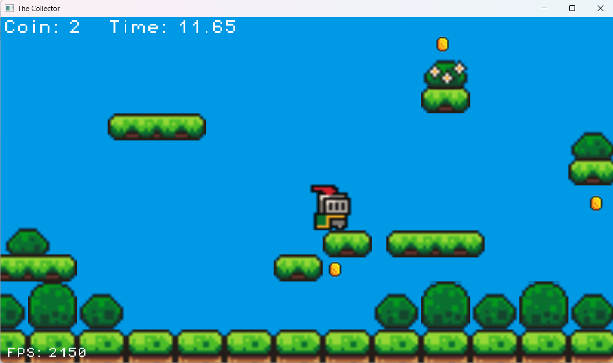

# The Collector:

## Introduction:
You can play with the collector and get the chance to collect all coins in time.  
The map of the game is created by [Tiled Map Editor v1.11.2](https://www.mapeditor.org/2025/01/28/tiled-1-11-2-released.html)  

## License:
The Collector © 2025 by Zsolt Sziráczki is licensed under [CC BY 4.0](https://creativecommons.org/licenses/by/4.0/).  

## Control
- Start: Press Enter
- Close Window: Press Esc or use your mouse.
- Player control: Press A and D and Jump with Space

## Assets:
The assets came form [here](https://brackeysgames.itch.io/brackeys-platformer-bundle) from Brackeys.

## Properties:
- Configuration Type:  
  - Application (.exe)
- C/C++ => Additional Include Directories:  
  - ..\Learning2DEngine  
  - $(SolutionDir)Plugins\Engine\include
- Post-Build Event:  
	When you build the game, the assets folder will be copied into output directory.  
    Note: if some files exist, they will be overwritten.

### Source code: [here](../TheCollector)