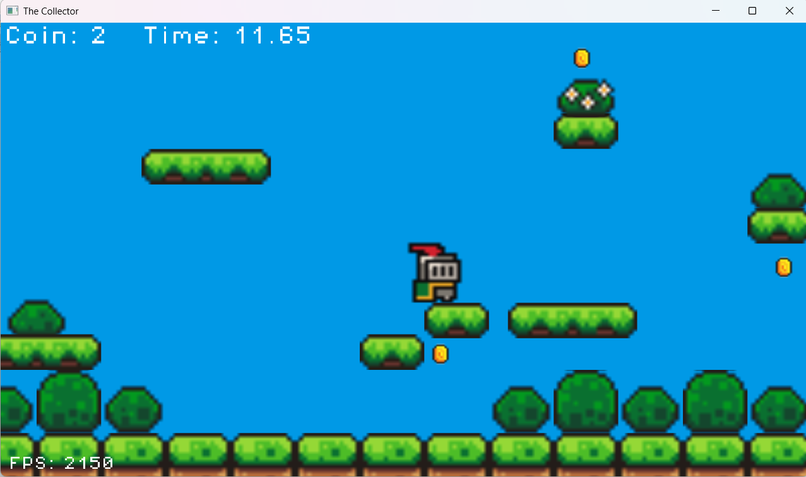

# The Collector:

## Introduction:
You can play with the collector and get the chance to collect all coins in time.

## License:
The Collector © 2025 by Zsolt Sziráczki is licensed under [CC BY 4.0](https://creativecommons.org/licenses/by/4.0/).  
_Note: In the past, it was under the CC BY-NC 4.0, but it has changed from version 1.7._

For sounds, there is the irrKlang, which I use it with
its non pro licence, which is [here](https://www.ambiera.com/irrklang/license.html).  
_Note: It is removeable from the code, if the USE_IRRKLANG_SOUND_ENGINE macro define as 0 and not 1._  
_But we have to remove manually the irrKlang.lib from the linker._

## Control
- Start: Press Enter
- Close Window: Press Esc or use your mouse.
- Player control: Press A and D and Jump with Space

## Assets:
The assets came form [here](https://brackeysgames.itch.io/brackeys-platformer-bundle) from Brackeys.

## Properties:
- Configuration Type:  
  - Application (.exe)
- VC++ Directories => Library Directories:  
  - $(SolutionDir)Plugins\Game\lib\irrKlang
- C/C++ => General => Additional Include Directories:  
  - ..\Learning2DEngine  
  - $(SolutionDir)Plugins\Engine\include  
  - $(SolutionDir)Plugins\Game\include
- Linker => Input => Additional Dependencies:  
  - irrKlang.lib
- Post-Build Event:  
  When you build the game, the assets folder will be copied into output directory.
  Plus the irrKlang DLL files are also copied into output directory from Plugin folder for the sounds.  
  Note: if some files exist, they will be overwritten.

### Source code: [here](../TheCollector)